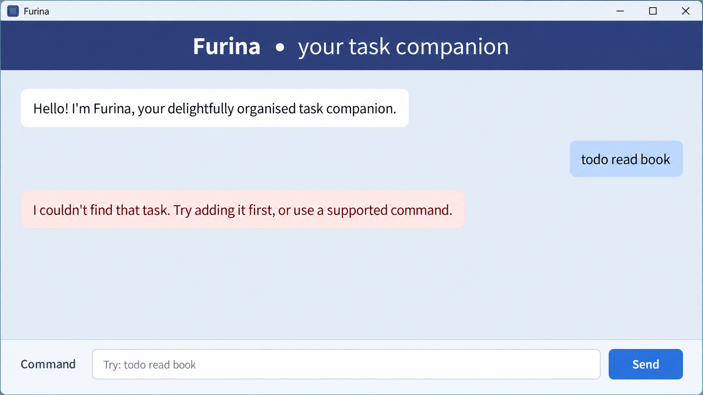

# Furina



Furina is a friendly task companion for keeping track of todos, deadlines, and
events. Type one command at a time in the GUI or console.

## Commands

### Add a todo

```text
todo <description>
```

Example: `todo submit assignment`

### Add a deadline

```text
deadline <description> /by <date>
```

Dates may use `YYYY-MM-DD`, `YYYY-MM-DD HHmm`, `D/M/YYYY`, or `D/M/YYYY HHmm`.
For example: `deadline submit report /by 2026-09-18`.

### Add an event

```text
event <description> /from <start> /to <end>
```

Example: `event project meeting /from Mon 2pm /to 4pm`

### Manage tasks

```text
list
mark <task number>
unmark <task number>
delete <task number>
find <keyword>
sort
bye
```

Furina highlights errors, rejects duplicate tasks, validates date-like input,
and keeps running after an invalid command. Tasks are saved in `data/duke.txt`.

## Running the product

Build the cross-platform release JAR with Java 25:

```text
./gradlew clean shadowJar
java -jar build/libs/duke.jar
```
